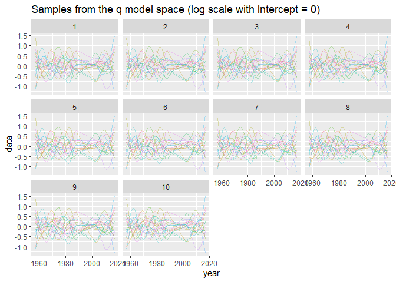

Working notes
================

``` r
library(icesTAF)
library(ggplot2)
```

    ## 
    ## Attaching package: 'ggplot2'

    ## The following object is masked from 'package:latticeExtra':
    ## 
    ##     layer

    ## The following object is masked from 'package:FLCore':
    ## 
    ##     %+%

``` r
library(mgcv)
```

    ## Loading required package: nlme

    ## 
    ## Attaching package: 'nlme'

    ## The following object is masked from 'package:FLa4a':
    ## 
    ##     coefficients<-

    ## This is mgcv 1.8-31. For overview type 'help("mgcv-package")'.

``` r
taf.library(FLCore)
taf.library(FLa4a)
```

build on Sun Feb 16 23:06:01 2020

## Model missing catches at age

``` r
data(ple4)
catch_na <- catch.n(ple4)
catch_na[,paste(1990:2000)] <- NA

data <- as.data.frame(quantSums(catch_na), drop = TRUE)
names(data)[names(data) == "data"] <- "catch_na"
data$catch_na <- as.numeric(is.na(data$catch_na))

# create a model
fmod <-
  submodel(
    name = "trawl-missing",
    range = range(ple4),
    formula = ~ s(year, catch_na, k = 9, bs = "totalCatch"),
    covariates = data
  )

vcov(fmod)["(Intercept)", "(Intercept)", 1] <- 0
```

``` r
ggplot(
  as.data.frame(
    genFLQuant(fmod, nsim = 20, seed = 1323)
  ),
  aes(x = year, y = data, colour = factor(iter))
) +
  geom_line(alpha = 0.3) +
  facet_wrap(~ age) +
  labs(
    title =
    "Samples from the q model space (log scale with Intercept = 0)"
  ) +
  theme(legend.position="none")
```

<!-- -->
